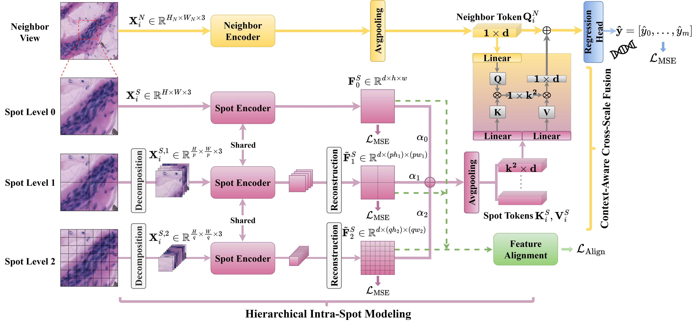
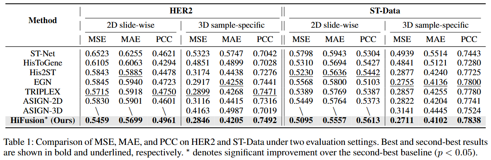
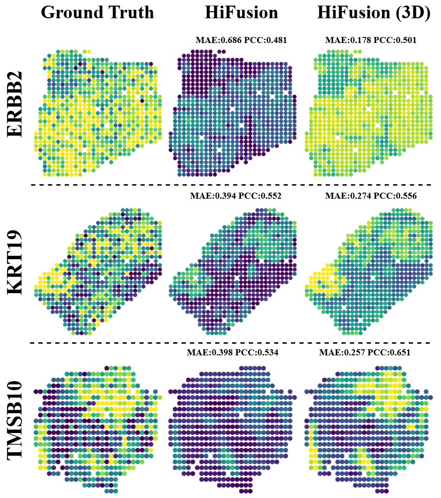

# HiFusion

**[AAAI 2026]**  
**HiFusion: Hierarchical Intra-Spot Alignment and Regional Context Fusion for Spatial Gene Expression Prediction from Histopathology**  
📄 [ArXiv Paper](https://arxiv.org/abs/2511.12969)

---

This repository provides the official implementation of **HiFusion**, a hierarchical deep learning framework for predicting spatial gene expression from histopathology images. HiFusion explicitly models **intra-spot biological heterogeneity** and **region-aware contextual information** through hierarchical feature alignment and cross-scale fusion.

---

## 🔍 Abstract

Spatial transcriptomics (ST) bridges gene expression and tissue morphology but faces barriers to clinical adoption due to high experimental costs and technical complexity. While recent computational methods attempt to infer gene expression directly from H&E-stained whole-slide images (WSIs), most fail to adequately model fine-grained intra-spot heterogeneity and are vulnerable to morphological noise when incorporating surrounding contextual information.

To address these challenges, we propose **HiFusion**, a novel deep learning framework composed of two complementary modules.  
First, **Hierarchical Intra-Spot Modeling (HISM)** decomposes each spot into multi-resolution sub-patches and enforces semantic consistency across scales via a feature alignment loss, enabling the extraction of fine-grained morphological representations.  
Second, **Context-Aware Cross-Scale Fusion (CCF)** leverages residual cross-attention to selectively integrate biologically relevant regional context, improving robustness against irrelevant morphological variations.

By jointly modeling cellular-level features and tissue-level microenvironmental cues, HiFusion achieves accurate and robust spatial gene expression prediction. Extensive experiments on two public ST benchmarks demonstrate state-of-the-art performance under both **2D slide-wise cross-validation** and the more challenging **3D sample-specific evaluation** protocols, highlighting HiFusion’s effectiveness and generalization ability.

---

## 📌 Framework Overview



**Overview of the HiFusion framework.**  
HiFusion integrates **Hierarchical Intra-Spot Modeling (HISM)** and **Context-Aware Cross-Scale Fusion (CCF)**.  
HISM hierarchically decomposes each spot into multi-scale patches to extract fine-grained features with semantic alignment.  
CCF fuses regional contextual features with multi-scale spot representations via residual cross-attention for spatial gene expression prediction.

---

## 📊 Processed Datasets

To facilitate reproducibility, we provide processed versions of two public spatial transcriptomics datasets:

- **HER2 Dataset**  
  - Dataset: (coming soon!)  
  - Paper: [link]([https://example.com](https://www.nature.com/articles/s41467-021-26271-2))

- **ST-Data Dataset**  
  - Dataset: (coming soon!)   
  - Paper: [link]([https://example.com](https://www.nature.com/articles/s41551-020-0578-x))

> Please download and place the processed datasets under the `data/` directory.

---

## 🚀 Training

### 2D Slide-wise Cross-Validation

```bash
python 2d_main.py   --root_path [path_to_dataset (place under data/)]   --save_path [path_to_save_models]
```

### 3D Sample-specific Validation

```bash
python 3d_main.py   --root_path [path_to_dataset (place under data/)]   --save_path [path_to_save_models]
```

---

## 🧪 Experimental Settings

We evaluate HiFusion under two complementary testing paradigms:

### 1️⃣ 2D Slide-wise Cross-Validation

This protocol follows standard practice in prior work.
We perform **4-fold cross-validation** on both datasets, ensuring that samples from the same patient appear exclusively in either the training or testing set to prevent data leakage. This setting evaluates cross-patient generalization.

### 2️⃣ 3D Sample-specific Validation

This is a more challenging and recently proposed evaluation protocol.
For each patient, the **first histological section** is used for training, while the remaining sections are reserved for testing. This setup emphasizes within-patient generalization and reduces inter-patient domain shift.

### 📐 Evaluation Metrics
Performance is assessed using three metrics:
- **Mean Squared Error (MSE)** – average squared prediction error
- **Mean Absolute Error (MAE)** – average absolute prediction error
- **Pearson Correlation Coefficient (PCC)** – linear correlation between predicted and ground-truth gene expression
Lower MSE and MAE indicate better accuracy, while higher PCC reflects stronger consistency with ground truth.
---

## 📈 Results

HiFusion consistently outperforms prior methods on both HER2 and ST-Data datasets under 2D slide-wise and 3D sample-specific evaluations.

Under 2D slide-wise testing, HiFusion achieves MSE / MAE / PCC scores of 0.5459 / 0.5699 / 0.4961 on HER2, surpassing:

TRIPLEX (second-best) by 2.1–2.6%

ASIGN (previous SOTA) by 2.0–3.7%

ST-Net by over 10% in MSE

Similar performance gains are observed on ST-Data, demonstrating strong robustness to cross-patient heterogeneity.

Under 3D sample-specific evaluation, HiFusion maintains consistent advantages, achieving 22–25% improvement over ST-Net, validating its effectiveness in modeling intra-patient spatial structures.

These results highlight HiFusion’s versatility across distinct evaluation settings and its robustness in spatial transcriptomics inference.



---

## 🎨 Visualization of Cancer Marker Genes

HiFusion not only achieves superior quantitative performance but also produces spatially coherent and biologically meaningful gene expression maps. High-expression regions are accurately localized (brighter colors), demonstrating robustness to morphological noise and strong alignment with ground truth.




---

## 🧩 Code Base

This codebase is built upon:

**ASIGN: Anatomy-aware Spatial Imputation Graphic Network for 3D Spatial Transcriptomics**  
*CVPR 2025*  
(https://github.com/hrlblab/ASIGN)

We sincerely thank the authors for releasing their high-quality codebase, which greatly facilitated this work.

---

## 📚 Citation
If you find this project useful, please cite our paper:
```bibtex
@article{weng2025hifusion,
  title={HiFusion: Hierarchical Intra-Spot Alignment and Regional Context Fusion for Spatial Gene Expression Prediction from Histopathology},
  author={Weng, Ziqiao and Fang, Yaoyu and Qian, Jiahe and Wang, Xinkun and Cooper, Lee AD and Cai, Weidong and Zhou, Bo},
  journal={arXiv preprint arXiv:2511.12969},
  year={2025}
}
```

